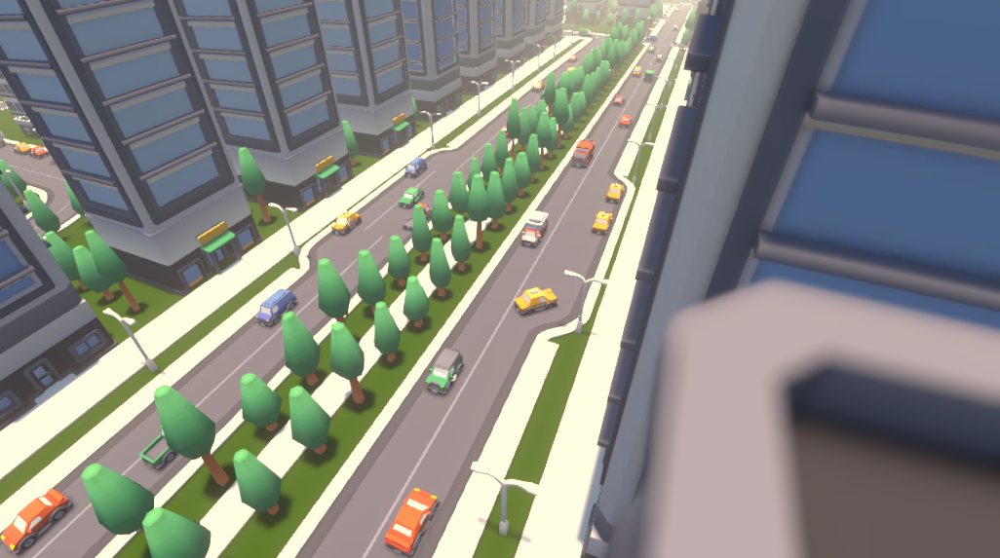
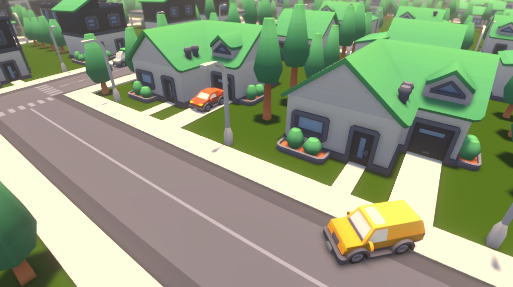
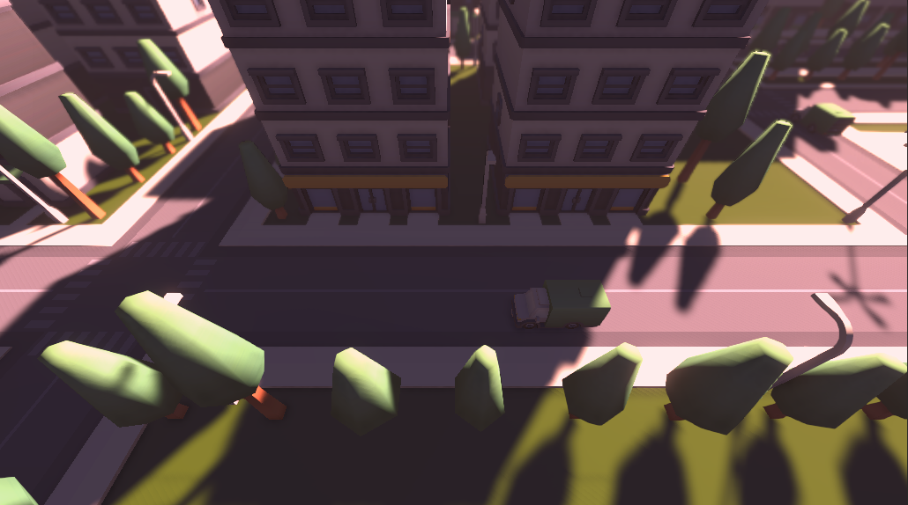
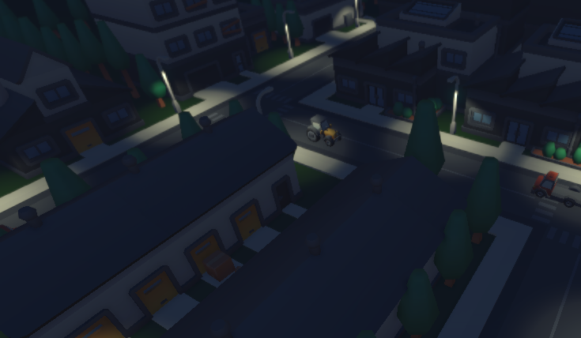
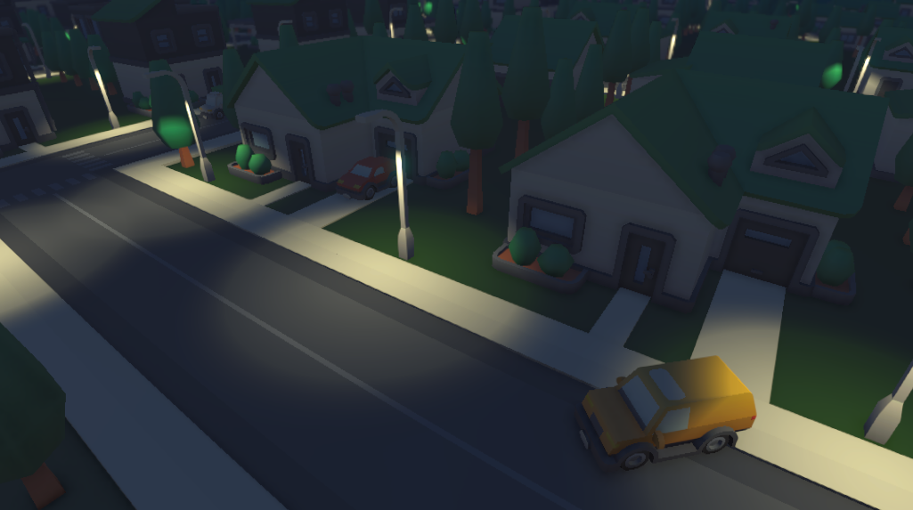

# Community Core Stack — City 01

> A complete, ready-to-use city built on [Kenney](https://kenney.nl) CC0 assets.  
> Free forever. No strings attached.

---

## Previews

<table>
  <tr>
    <td></td>
    <td></td>
  </tr>
  <tr>
    <td></td>
    <td></td>
  </tr>
  <tr>
    <td colspan="2" align="center"></td>
  </tr>
</table>

---

## What is this?

**City 01** is the first release under the **Community Core Stack** initiative — a growing library of high-quality, CC0-licensed Unity environments built for the entire game dev community.

The goal is simple: give developers a polished, realistic city they can drop into any Unity project without worrying about licensing, attribution, or cost. Personal projects, commercial games, tutorials, game jams — all covered.

This city was hand-crafted using [Kenney's 3D asset packs](https://kenney.nl/assets) and includes:

- A dense **downtown district** with skyscrapers and wide boulevards
- A **residential neighborhood** with houses, driveways, and parked cars
- Street lighting for convincing **day and night** scenes
- Roads, sidewalks, trees, and props throughout
- Vehicles scattered across the city to bring it to life

---

## License

**CC0 — No Rights Reserved.**

All source assets are from [Kenney.nl](https://kenney.nl), released under CC0. This project inherits the same license. You can use, modify, and distribute everything here — commercially or otherwise — without asking for permission.

No credit required. Though it's always appreciated.

---

## Getting Started

### Requirements
- Unity **2022.3 LTS** or newer (URP recommended)

### Import

1. Clone or download this repository
2. Open Unity Hub and add the project folder
3. Open the main city scene under `Assets/Scenes/`
4. Hit Play

That's it. No package setup, no paid dependencies.

---

## What is Community Core Stack?

Game development moves faster when the community builds together.

**Community Core Stack** is an open initiative to produce high-quality, ready-to-use Unity environments that anyone can pick up and build on. City 01 is the first entry — more cities, environments, and scene types are planned.

If you want to contribute a scene, improve an existing one, or just follow along, open an issue or reach out directly.

---

## Author

Made by **lucspinto**  
Part of the *Game Dev Creative* series — focused on the visual and creative side of Unity game development.

- LinkedIn: [linkedin.com/in/lucspinto](https://www.linkedin.com/in/lucspinto)
- GitHub: [github.com/lucspinto](https://github.com/lucspinto)
- Website: [Podnerado Game Dev](https://web-ponderado-game-dev.vercel.app/)
- Courses: [Udemy Courses](https://www.udemy.com/user/lucas-r-pinto/)